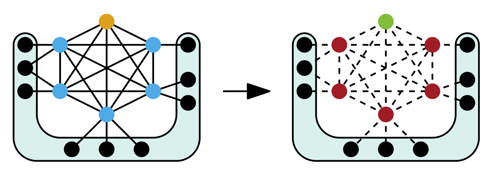

# KaMIS v3.0 #
[](https://app.codacy.com/gh/KarlsruheMIS/KaMIS?utm_source=github.com&utm_medium=referral&utm_content=KarlsruheMIS/KaMIS&utm_campaign=Badge_Grade_Dashboard)
[](https://opensource.org/licenses/MIT)
[](https://app.fossa.com/projects/git%2Bgithub.com%2FKarlsruheMIS%2FKaMIS?ref=badge_shield)
## Description ##
This is the open source project KaMIS - Karlsruhe Maximum Independent Sets. Given a graph G=(V,E), the goal of the maximum independent set problem is to compute a maximum cardinality set of vertices I, such that no vertices in the set are adjacent to one another. Such a set is called a maximum independent set. The problem is NP-hard and particularly difficult to solve in large sparse graphs. 

<p align="center">

</p>


Main project site:
<http://KarlsruheMIS.github.io>

## Installation ##
As a first step, please run *git submodule --init --recursive*. Then compile the source by running *compile_withcmake.sh*. The binaries can then be found in the folder *deploy*.  To compile the programs you need g++, OpenMP and cmake installed. 

To convert a graph from DIMACS to METIS format or sort its edges you can use the python scripts in the *misc* folder.

The version of our framework currently contains the following algorithms:
* struction -- a branch and reduce algotrithm with increasing transformations
* mmwis -- run an iterative reduce and evolution algorithm for the weighted problem
* redumis -- run an evolutionary algorithm on a reduced graph 
* onlinemis -- local search pruned with reductions
* weighted_branch_reduce -- a branch and reduce algorithm for weighed maximum independent sets
* weighted_local_search -- a local search algorithm for weighed maximum independent sets
* If you want to use the solver that one the vertex cover track of the PACE Challenge, go here <https://github.com/KarlsruheMIS/pace-2019>

Furthermore, the framework contains tools to make life a little bit easier:
* sort_adjacencies -- takes a graph file and sorts the neighborhoods of vertices (this is required by our algorithms) 
* graphchecker -- check if the graph file you gave to algorithm is in the correct format

## NEW in v3.0: 
*mmwis (Memetic Maxmimum Weight Independent Set):* Our iterative reduce and evolution algorithm to solve the maximum weight independent set problem.

*struction:* Our new branch and reduce algorithm using increasing transformations. 


## Usage ReduMIS ##
`redumis FILE [options]`.    

### Options ###
This is a brief overview of the most important options.
For a full description, please take a look at the user guide.

`FILE`
Path to graph file that you want the maximum independent set for.

`--help`
Print help.

`--console_log`
Write the log to the console.

`--output=<string>`
Path to store the resulting independent set.

`--seed=<int>`
Seed to use for the random number generator.

`--config=<string>`
Config to use for the evolutionary algorithm [standard|social].

`--time_limit=<double>`
Time limit until the algorithm terminates.

## Usage OnlineMIS ##
`online_mis FILE [options]`.    

### Options ###
This is a brief overview of the most important options.
For a full description, please take a look at the user guide.

`FILE`
Path to graph file that you want the maximum independent set for.

`--help`
Print help.

`--console_log`
Write the log to the console.

`--output=<string>`
Path to store the resulting independent set.

`--seed=<int>`
Seed to use for the random number generator.

`--time_limit=<double>`
Time limit until the algorithm terminates.

`--adaptive_greedy`
Use adaptive greedy solution

## Usage Weighted Branch and Reduce ##
`weighted_branch_reduce FILE [options]`.    
`weighted_local_search FILE [options]`.    

### Options ###
This is a brief overview of the most important options.
For a full description, please take a look at the user guide.

`FILE`
Path to graph file that you want the maximum independent set for.

`--help`
Print help.

`--console_log`
Write the log to the console.

`--output=<string>`
Path to store the resulting independent set.

`--seed=<int>`
Seed to use for the random number generator.

`--time_limit=<double>`
Time limit until the algorithm terminates.

`--weight_source=<string>`
Choose how the weights are assigned. Can be either: file (default), hybrid, uniform, geometric.

`--reduction_style=<string>`
Choose the type of reductions appropriate for the input graph. Can be either: normal/sparse (default), dense/osm.

## Usage MMWIS ##
`mmwis FILE [options]`.    


### Options ###
This is a brief overview of the most important options.
For a full description, please take a look at the user guide.

`FILE`
Path to graph file that you want the maximum independent set for.

`--help`
Print help.

`--console_log`
Write the log to the console.

`--output=<string>`
Path to store the resulting independent set.

`--seed=<int>`
Seed to use for the random number generator.

`--config=<string>`
Config to use for the evolutionary algorithm [mmwis|mmwiss].

`--time_limit=<double>`
Time limit until the algorithm terminates.

## Usage struction ##
`struction FILE [options]`.    


### Options ###
This is a brief overview of the most important options.
For a full description, please take a look at the user guide.

`FILE`
Path to graph file that you want the maximum independent set for.

`--help`
Print help.

`--console_log`
Write the log to the console.

`--output=<string>`
Path to store the resulting independent set.

`--seed=<int>`
Seed to use for the random number generator.

`--time_limit=<double>`
Time limit until the algorithm terminates.

`--cyclicStrong`
Use cyclicStrong instead of cyclicFast (default).

## Usage Sort Adjacencies ##
`sort_adjacencies FILE`.    

The program reads a Metis file, sorts the neighborhood of each node and prints the graph to the console.

## Usage Graph Checker ##
`graphchecker FILE`.    

The program reads a Metis file and checks the file for correctness.


## License
The project is released under MIT. However, some files used for kernelization are released under the BSD 3-clause license. See the respective files for their license.
If you publish results using our algorithms, please acknowledge our work by quoting one or more of the following papers:
```
@article{DBLP:journals/heuristics/LammSSSW17,
  author    = {Sebastian Lamm and
               Peter Sanders and
               Christian Schulz and
               Darren Strash and
               Renato F. Werneck},
  title     = {Finding near-optimal independent sets at scale},
  journal   = {J. Heuristics},
  volume    = {23},
  number    = {4},
  pages     = {207--229},
  year      = {2017},
  url       = {https://doi.org/10.1007/s10732-017-9337-x},
  doi       = {10.1007/s10732-017-9337-x},
  timestamp = {Fri, 27 Dec 2019 21:13:52 +0100},
  biburl    = {https://dblp.org/rec/journals/heuristics/LammSSSW17.bib},
  bibsource = {dblp computer science bibliography, https://dblp.org}
}
```

If you use fast kernelization routines (note that this is the default), the please also cite the following:
```
@article{DBLP:journals/jea/Hespe0S19,
  author    = {Demian Hespe and
               Christian Schulz and
               Darren Strash},
  title     = {Scalable Kernelization for Maximum Independent Sets},
  journal   = {{ACM} Journal of Experimental Algorithmics},
  volume    = {24},
  number    = {1},
  pages     = {1.16:1--1.16:22},
  year      = {2019},
  url       = {https://doi.org/10.1145/3355502},
  doi       = {10.1145/3355502},
  timestamp = {Fri, 27 Mar 2020 08:38:35 +0100},
  biburl    = {https://dblp.org/rec/journals/jea/Hespe0S19.bib},
  bibsource = {dblp computer science bibliography, https://dblp.org}
}
```

If you use OnlineMIS, then please also cite the following:
```
@inproceedings{DBLP:conf/wea/DahlumLS0SW16,
  author    = {Jakob Dahlum and
               Sebastian Lamm and
               Peter Sanders and
               Christian Schulz and
               Darren Strash and
               Renato F. Werneck},
  title     = {Accelerating Local Search for the Maximum Independent Set Problem},
  booktitle = {15th International Symposium on Experimental Algorithms {SEA}},
  pages     = {118--133},
  year      = {2016},
  series    = {Lecture Notes in Computer Science},
  volume    = {9685},
  publisher = {Springer},
  url       = {https://doi.org/10.1007/978-3-319-38851-9\_9}
}
```

If you use the weighted independents set algorithms, please also cite the following: 
```
@inproceedings{DBLP:conf/alenex/Lamm0SWZ19,
        author    = {Sebastian Lamm and
                     Christian Schulz and
                     Darren Strash and
                     Robert Williger and
                     Huashuo Zhang},
        title     = {Exactly Solving the Maximum Weight Independent Set Problem on Large Real-World Graphs},
        booktitle = {Proceedings of the Twenty-First Workshop on Algorithm Engineering and Experiments, {ALENEX} 2019},
        pages     = {144--158},
        year      = {2019},
        url       = {https://doi.org/10.1137/1.9781611975499.12},
        doi       = {10.1137/1.9781611975499.12},
        publisher = {{SIAM}},
        year      = {2019}
}
```

if you use struction, please also cite the following: 
```
@article{DBLP:journals/corr/abs-2008-05180,
  author       = {Alexander Gellner and
                  Sebastian Lamm and
                  Christian Schulz and
                  Darren Strash and
                  Bogd{\'{a}}n Zav{\'{a}}lnij},
  title        = {Boosting Data Reduction for the Maximum Weight Independent Set Problem
                  Using Increasing Transformations},
  journal      = {CoRR},
  volume       = {abs/2008.05180},
  year         = {2020},
  url          = {https://arxiv.org/abs/2008.05180},
  eprinttype    = {arXiv},
  eprint       = {2008.05180},
  timestamp    = {Sun, 16 Aug 2020 17:19:29 +0200},
  biburl       = {https://dblp.org/rec/journals/corr/abs-2008-05180.bib},
  bibsource    = {dblp computer science bibliography, https://dblp.org}
}
```

if you use mmwis, please also cite the following: 
```
@inproceedings{dblp:conf/gecco/grossmannl0s23,
  author       = {ernestine gro{\ss}mann and
                  sebastian lamm and
                  christian schulz and
                  darren strash},
  editor       = {sara silva and
                  lu{\'{\i}}s paquete},
  title        = {finding near-optimal weight independent sets at scale},
  booktitle    = {proceedings of the genetic and evolutionary computation conference,
                  {gecco} 2023, lisbon, portugal, july 15-19, 2023},
  pages        = {293--302},
  publisher    = {{acm}},
  year         = {2023},
  url          = {https://doi.org/10.1145/3583131.3590353},
  doi          = {10.1145/3583131.3590353},
  timestamp    = {fri, 02 aug 2024 15:50:42 +0200},
  biburl       = {https://dblp.org/rec/conf/gecco/grossmannl0s23.bib},
  bibsource    = {dblp computer science bibliography, https://dblp.org}
}
```


[](https://app.fossa.com/projects/git%2Bgithub.com%2FKarlsruheMIS%2FKaMIS?ref=badge_large)
